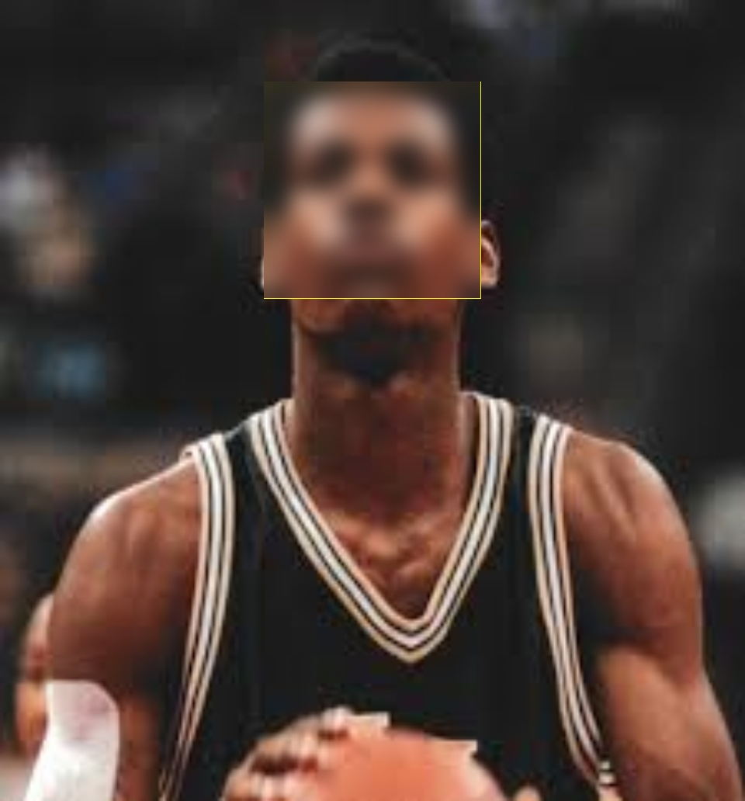

# Blurring Faces

A simple code which can be used to blur faces in an image using OpenCV. First Haar Cascade Face Classifier is used to detect the faces in an image then it applies Gaussian Blur to blur the faces and shows the final image.

If the below image is givem as input

The final image would be:

